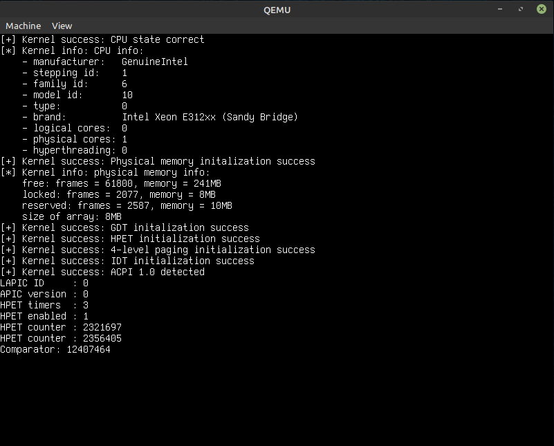
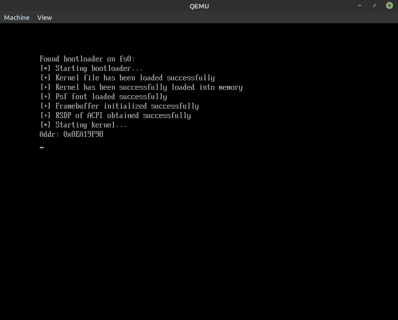

# printOS

## How to setup

### Requirements

- NASM
- gcc && g++
- Qemu (`sudo apt install qemu qemu-utils qemu-system-x86 qemu-system-gui`)

### Start development

1. Download a GNU-EFI source code. Place it in the `bootloader/gnuefi` directory.
2. `./init.sh`

### Run OS

Tool chain: `./recompile.sh && ./build-img.sh && ./run.sh`

## Kernel
64-bit simple hobby kernel written in C++ for educational purpose and fun.

### Features

- [x] CPUID - state and features checking
- [x] Framebuffer (double-buffering) driver, writing output, colors
- [x] Basic read-only console
- [x] GDT - flat model
- [x] Physical memory allocator
- [x] Virtual memory - 64-bit paging
- [x] IDT - basic interrupts
- [x] Very basic libc (it will be written further if needed)
- [x] Kernel panic && asserts
- [x] ACPI support
- [X] Local APIC and I/O APIC support
- [X] High Precision Event Timer (HPET): one-shot and periodic mode
- [X] Heap (kmalloc & free)
- [ ] PS/2 driver (keyboard support)
- [ ] All x86 exceptions
- [ ] Uniprocessor multitasking
- [ ] User mode
- [ ] Virtual relocation over 0xFFFFFFFF

## Bootloader (UEFI)
My GNU-EFI (UEFI) bootloader written in C for fun and education.

### Features

- [x] Reading kernel file from drive
- [x] ELF kernel parsing and loading into memory
- [x] Framebuffer initialization
- [x] Memory map gathering
- [x] Psf font loading
- [x] ACPI support
- [x] Error checking
- [x] Jumping into kernel

### Documentation & specifications abbreviations used in comments

- IM3 - Intel Manual, vol. 3
- EFI - UEFI Specification
- ACP - ACPI Documentation
- APC - APIC Specification
- IOA - IO APIC Documentation
- HPT - HPET Documentation
